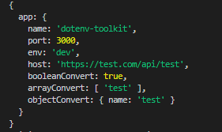

# dotenv-addon

# If you found a bug, please open an issue.

## A package with add-ons to make the job easier when used in conjunction with dotenv

## With this package, you will be able to convert your config env file with your respective data structures declarated in .env file and interpolate the strings.

## Example with parsed config object: 



### To see all the parses that you can use and how you can interpolate, see the .env.example file

## Installation

### First install the plugin via npm.

```sh
npm install dotenv-addon
```

## Usage Example
```js
const env = require('dotenv').config()
const { expandEnv } = require('dotenv-addon')

module.exports = expandEnv({
    dotEnvObject: env.parsed,
    config: {
        app: {
            name: process.env.APP_NAME,
            port: process.env.PORT,
            env: process.env.NODE_ENV,
            host: process.env.TEST_ENV_INTERPOLATE,
            booleanConvert: process.env.TEST_BOOLEAN_CONVERT,
            arrayConvert: process.env.TEST_ARRAY_CONVERT,
            objectConvert: process.env.TEST_OBJECT_CONVERT
          },
    },
    interpolateEnv: true
})

```